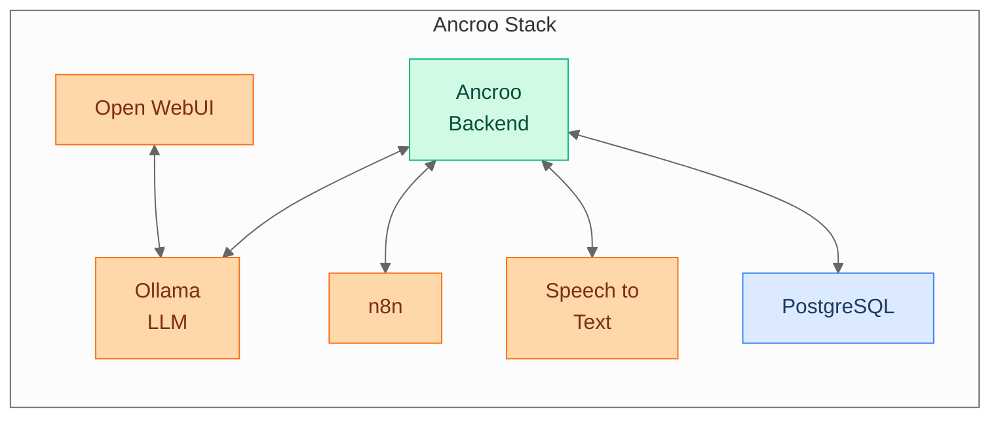

#  Ancroo Stack

[](LICENSE)
[](https://www.docker.com/)
[](https://docs.docker.com/compose/)
[](https://www.gnu.org/software/bash/)
[]()

Self-hosted Docker stack for AI — Ollama, Open WebUI, n8n, BookStack, speech-to-text, and more. One installer, everything runs.

> **Phase 0 (Beta)** — The base installation runs on HTTP without authentication and is intended for local/trusted networks only. SSL and SSO modules exist but are experimental. See the [Ancroo Roadmap](https://github.com/ancroo/ancroo/blob/main/ROADMAP.md) for the security path forward.

## Architecture



## Quick Start

```bash
git clone https://github.com/ancroo/ancroo-stack.git
cd ancroo-stack
bash install.sh
```

The guided installer walks you through GPU selection and STT engine choice, and optionally clones companion projects (backend, runner, browser extension).

After installation, your stack is running:

| Service    | URL                 | Description                              |
| ---------- | ------------------- | ---------------------------------------- |
| Open WebUI | `http://<IP>:8080`  | Chat interface with RAG support          |
| Ollama API | `http://<IP>:11434` | LLM backend (Llama, Mistral, Qwen, etc.) |
| Homepage   | `http://<IP>:80`    | Service dashboard                        |
| n8n        | `http://<IP>:5678`  | Workflow automation                      |
| BookStack  | `http://<IP>:8875`  | Documentation wiki                       |
| Adminer    | `http://<IP>:8081`  | Database management UI                   |
| STT        | `http://<IP>:8100`  | Speaches or Whisper-ROCm                 |
| PostgreSQL | internal            | Shared database with pgvector            |

The first Open WebUI account you create becomes admin.

## Services

All services are included in the base installation — no modules to enable.

| Service | Container | Purpose |
| ------- | --------- | ------- |
| PostgreSQL (pgvector) | `postgres` | Shared database |
| Ollama | `ollama` | Local LLM engine |
| Open WebUI | `open-webui` | AI chat interface |
| Homepage | `homepage` | Service dashboard |
| Adminer | `adminer` | Database admin UI |
| n8n | `n8n` | Workflow automation |
| BookStack | `bookstack` + `bookstack-db` | Documentation wiki |

**STT engines** (one is selected during install):

| Engine | Container | GPU Support |
| ------ | --------- | ----------- |
| Speaches | `speaches` | CPU, NVIDIA CUDA |
| Whisper-ROCm | `whisper-rocm` | AMD ROCm |

**Optional companion projects** (cloned during install if desired):

| Project | Container | Purpose |
| ------- | --------- | ------- |
| [Ancroo Backend](https://github.com/ancroo/ancroo-backend) | `ancroo-backend` | AI workflow API |
| [Ancroo Runner](https://github.com/ancroo/ancroo-runner) | `ancroo-runner` | Script execution engine |

## Stack Management

```bash
./stack.sh status          # Container status
./stack.sh verify          # Health checks
./stack.sh urls            # All service URLs
./stack.sh gpu <mode>      # Switch GPU (cpu/nvidia/rocm)
./stack.sh stt <engine>    # Switch STT (speaches/whisper-rocm)
```

## Non-Interactive Installation

All wizard prompts can be skipped via environment variables:

```bash
ANCROO_GPU_MODE=rocm ANCROO_OLLAMA_MODEL=mistral ANCROO_NONINTERACTIVE=1 bash install.sh
```

| Variable                 | Values                              | Default            |
| ------------------------ | ----------------------------------- | ------------------ |
| `ANCROO_GPU_MODE`        | `nvidia`, `rocm`, `cpu`             | interactive prompt |
| `ANCROO_OLLAMA_MODEL`    | model name, `none`, empty           | interactive prompt |
| `ANCROO_STT_ENGINE`      | `speaches`, `whisper-rocm`          | auto (based on GPU)|
| `ANCROO_NONINTERACTIVE`  | set to skip all prompts             | —                  |
| `ANCROO_CLONE_PROJECTS`  | `1` to auto-clone backend/runner/web| —                  |
| `ANCROO_FORCE_REINSTALL` | `1` to overwrite .env               | —                  |

## GPU Support

GPU mode is selected during installation:

```bash
bash install.sh
# Prompts for GPU mode: NVIDIA / AMD / CPU
```

| GPU    | Ollama Image                  | STT Module   |
| ------ | ----------------------------- | ------------ |
| NVIDIA | `ollama/ollama:latest` (CUDA) | speaches     |
| AMD    | `ollama/ollama:rocm`          | whisper-rocm |
| CPU    | `ollama/ollama:latest`        | —            |

## Documentation

| Document                               | Content                                            |
| -------------------------------------- | -------------------------------------------------- |
| [Operations Guide](docs/operations.md) | Installation, updates, backups, URLs               |
| [Security Guide](docs/security.md)     | Network exposure, firewall, credential management  |

## Requirements

- **OS:** Linux (Ubuntu 22.04+, Debian 12+)
- **Docker:** 24.0+ with Compose plugin
- **RAM:** 4 GB minimum, 8 GB+ recommended
- **Disk:** 20 GB minimum (LLM models need additional space)

Install Docker:

```bash
curl -fsSL https://get.docker.com | sh
sudo usermod -aG docker $USER
# Re-login for group permissions
```

### GPU-specific requirements

**NVIDIA:** Install the [NVIDIA Container Toolkit](https://docs.nvidia.com/datacenter/cloud-native/container-toolkit/install-guide.html).

**AMD ROCm:** Requires `amdgpu-dkms` from the AMDGPU 31.20+ repository (ROCm 7.2+). The driver must provide `/dev/kfd`, `/dev/dri`, and `/dev/accel`. Older driver versions (AMDGPU 30.x / ROCm 6.x) are not supported and will cause GPU detection failures or crashes.

```bash
# Install or upgrade the AMD GPU driver (Ubuntu 24.04)
sudo apt install amdgpu-dkms amdgpu-dkms-firmware
sudo reboot
# Verify: all three device paths must exist
ls /dev/kfd /dev/dri/renderD128 /dev/accel/accel0
```

| AMD Architecture | GPUs | Status |
|---|---|---|
| gfx1100–1102 | RDNA 3 (RX 7000 series) | Supported |
| gfx1151 | RDNA 4 iGPU (Radeon 8060S, Ryzen AI MAX) | Supported |
| gfx1105 | RDNA 3 iGPU (Radeon 780M, 760M) | Supported |
| gfx1030 | RDNA 2 (RX 6000 series) | Supported |
| gfx908, gfx90a, gfx942 | AMD Instinct (MI series) | Supported |

## Contributing

Contributions are welcome! Feel free to open an [issue](https://github.com/ancroo/ancroo-stack/issues) or submit a pull request.

## Security

To report a security vulnerability, please use [GitHub's private vulnerability reporting](https://github.com/ancroo/ancroo-stack/security/advisories/new) instead of opening a public issue.

## License

Apache 2.0 — see [LICENSE](LICENSE). The Ancroo name is not covered by this license and remains the property of the author.

**Important:** This license covers the ancroo-stack orchestration code (shell scripts, Docker Compose files, configuration templates). Each module's software runs in its own Docker container and is governed by its own license — see [NOTICE](NOTICE) for details.

## Author

**Stefan Schmidbauer** — [GitHub](https://github.com/Stefan-Schmidbauer)

---

Built with the help of AI ([Claude](https://claude.ai) by Anthropic).
